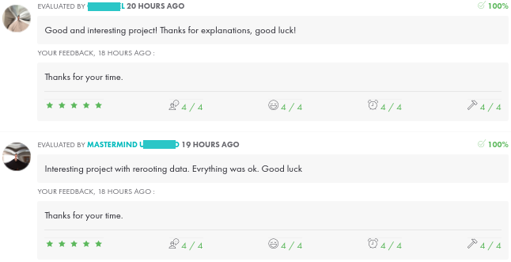

*This project was created in July 2026 as part of the 42 curriculum by tclouet.*

# Description

*This section presents the project, its goals, and a brief overview.*

The Inquisitor program aims to perform full-duplex ARP poisoning, allowing it to intercept traffic between an FTP client and an FTP server. It should also be able to analyze intercepted traffic and display the names of files uploaded from the FTP client to the FTP server.

The program is written in Python, and its dependencies are managed using a virtual environment created with `venv`.

#### Note:
    This project is intended for educational purposes only. Use it exclusively in controlled environments where you have authorization to perform network analysis.

# Architecture

The project uses three Docker containers connected through an isolated network:

- Client: generates files and uploads them through FTP.

- Server: runs an FTP server and stores uploaded files.

- Inquisitor: performs ARP poisoning between the client and server, intercepts packets, and analyzes FTP traffic.

# Instructions

*This section contains information about installation and execution.*

*Before starting, ensure that Python 3.11 or later and Docker Engine are installed.*

1. ### **Build and start the project:**

    At the root of the project, execute the following commands:

    - Build all the Docker images: `make build`.
    - Start all the Docker containers: `make up`.

    The terminal will output the IP and MAC addresses of each container.
    
    In separate terminals:

    - Navigate inside one of these containers: `docker exec -it <client/inquisitor/server> bash`.    

#### Note:
    To display all the available commands, run: `make help`

2. ### **Set up the client container:**

    Inside the container, run the following commands:
	
    - Create a test folder with numerous files: `python3 create_test_files.py`. 
    - To connect the FTP client to the server: `tnftp server 21`
    - Use `anonymous` as the username.

    You can choose your own password. Once this is done, you are connected to the FTP server.
 
    To upload a file to the server, run:
    - `put /home/test_environment/test_file_<number.extension> /uploads/<file_name>`

3. ### **Set up the inquisitor container:**

    Inside the container, run the following commands:
	
    - Create a venv and install dependencies: `python3 install.py`. 
    - Activate the virtual environment: `source venv/bin/activate`.

    To intercept the network traffic through ARP poisoning:

    - Launch the Inquisitor program: `python3 inquisitor.py <IP_client> <MAC_client> <IP_server> <MAC_server>`

    The program must display the name of the uploaded file.

#### Note:
    The `which python` command should return: `/app/venv/bin/python`.

4. ### **Check the server container:**

    In the server container, run the following commands:
	
    - Navigate to the `/uploads` directory: `cd /srv/ftp/uploads/`. 
    - Check that files are correctly uploaded: `ls`.

5. ### **Stop and clean up the project:**

    - To deactivate the virtual environment, run: `deactivate`.

    - To leave a Docker container, type: `exit`.

    - To clean the project: `make destroy`

#### Note:
    Running `make destroy` will prompt you for confirmation before removing the project resources.

# Technical Notes

**ARP**  
The Address Resolution Protocol (ARP) is a protocol used to map an IPv4 address to the MAC address of a device on a local area network (LAN). This allows devices to communicate at the data link layer while using IP addresses at the network layer.

This mapping procedure is important because IP and MAC addresses differ in length, requiring translation for systems to recognize one another. The most widely used IP version today is IP version 4 (IPv4). An IP address is 32 bits long, whereas MAC addresses are 48 bits long. ARP maps an IPv4 address to the corresponding MAC address of a device on the local network.

**ARP spoofing**  
ARP spoofing can be used to perform a man-in-the-middle (MITM) attack by redirecting traffic between two hosts through the attacker.

**OSI**  
The OSI (Open Systems Interconnection) model is a conceptual reference model that standardizes how network communications are structured and understood. It divides the communication process into seven layers, each with specific functions and responsibilities. Although modern networks primarily use the TCP/IP protocol suite, the OSI model is widely used to understand network operations, troubleshoot communication issues, and analyze the security risks and vulnerabilities associated with each layer.

**Router**  
A router is a networking device that connects different networks and forwards data packets between them. In a local area network (LAN), the router typically acts as the default gateway, receiving traffic destined for external networks (such as the Internet) and routing incoming and outgoing traffic to the appropriate destination.

**FTP protocol**  
The File Transfer Protocol (FTP) is a standard network protocol used to transfer files between a client and a server over a TCP/IP network. It allows users to upload, download, rename, delete, and manage files on a remote server. FTP typically uses TCP port 21 for control commands and TCP port 20 for data transfer in active mode.

# Resources
 
- [Docker Compose documentation](https://docs.docker.com/reference/cli/docker/compose/)
- [TNFTP documentation](https://manpages.ubuntu.com/manpages/jammy/man1/tnftp.1.html)
- [VSFTPD Configuration](https://doc.ubuntu-fr.org/vsftpd)
- [Create a network scanner](https://www.youtube.com/watch?v=TX-MSSIjL8E)
