*This project was created in June 2026 as part of the 42 curriculum by tclouet.*

# Description

*This section presents the project, its goals, and a brief overview.*

The `reverse_me` project is an introduction to reverse engineering.

It consists of three programs with increasing levels of difficulty. The goal is to understand how each binary works and discover the password required to complete it. The final task is to recreate the first program in C.

# Instructions

*This section contains information about installation and execution.*

*Before starting, please ensure that Docker Engine is installed.*

1. ### **Build and start the container:**

    In terminal, execute the following commands:

    - Build the Docker image: `docker build -t r_me_image .`.
    - Start the Docker container: `docker run --name r_me_container r_me_image`.

2. ### **Launch an exercise:**

    In a second terminal, execute the following commands:

    - Open a shell inside the container: `docker exec -it r_me_container bash`.

    You are now in the `/app` directory where the exercises are stored.  
    
        root@62abb8b9ba37:/app# ls
        level1  level2  level3

    Navigate to the desired folder and type:

    - Launch the desired exercise: `./level[number]`.

    The program will prompt you:

        root@340b9bb31046:/app/level1# ./level1 
        Please enter key:
    
    If the key is incorrect, the program prints "Nope."; otherwise, it prints "Good job."

3. ### **Stop and clean up the project:**

    - Stop the container: docker stop r_me_container

    - Remove the Docker image: docker rmi -f r_me_image

# Solving the exercises

## Level 1

The analysis begins by identifying the binary with the `file` command. The output shows that the executable is a 32-bit ELF binary and, most importantly, that it is **not stripped**. This means function names are still available, making the analysis much easier.

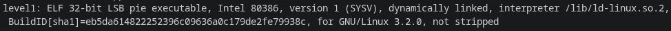

Next, the binary is loaded into GDB. Using `info functions` reveals the imported functions (`printf`, `scanf`, `strcmp`) as well as the program's `main` function, which is the logical starting point for the analysis.

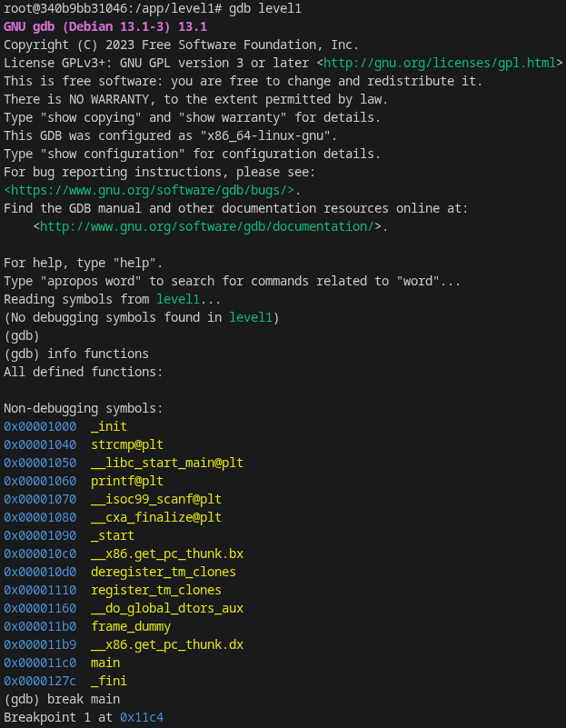

A breakpoint is then set on `main`, and the function is disassembled. The assembly code shows that the program prompts the user for a key with `printf`, reads the input using `scanf`, and finally compares it with a reference string using `strcmp`.

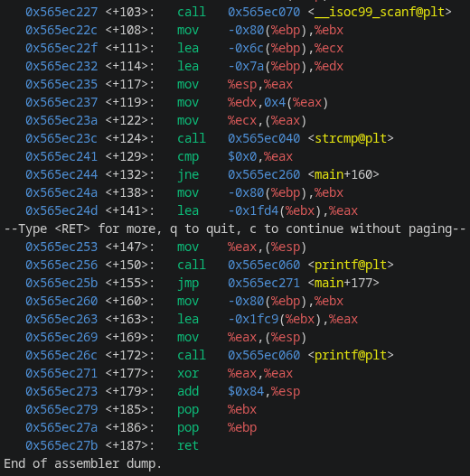

To determine the expected password, a breakpoint is placed just before the call to `strcmp`. At this point, the registers contain the two arguments passed to the function: the user input (`ECX`) and the expected string (`EDX`). Examining these registers with `x/s` reveals both strings, allowing the correct password to be recovered directly.

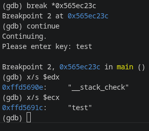

## Level 2

Unlike the first exercise, the analysis was performed by first decompiling the binary with `Binary Ninja`. The generated pseudocode was then cleaned up into readable C code, making the program's logic much easier to understand before validating the findings in GDB.

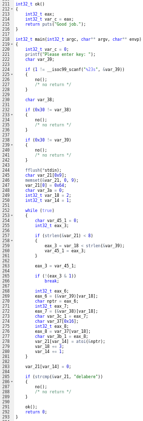

The decompiler represents the input buffer as a series of stack variables (var_39, var_38, ...) rather than as a character array. This is a consequence of the stack layout. Since the program calls scanf("%23s", &var_39), the user input is stored starting at the address of var_39, meaning that each subsequent stack byte corresponds to the next character of the input:

    var_39 == input[0]
    var_38 == input[1]
    var_37 == input[2]
    ...

The reconstructed code therefore reveals that the program first checks whether the input begins with two '0' characters. If either check fails, the program immediately calls `no()`.
The code also shows that the output string is initialized with the character 'd' before any user input is processed. As a result, the ASCII value of 'd' must not be included in the input, since it is already present in the reconstructed key.

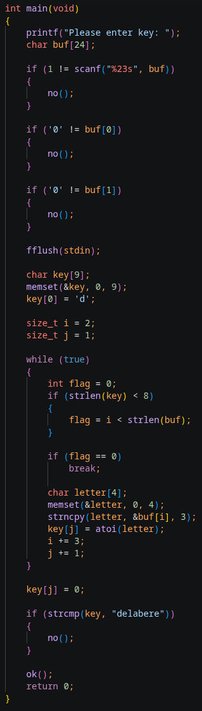

The remaining input is then processed in groups of three characters. Each group is interpreted as a decimal number with `atoi()`, and the resulting integer is stored as a single ASCII character, gradually reconstructing the expected string. Because the algorithm always reads three characters at a time, ASCII values below 100 (such as 97 for 'a' or 98 for 'b') must be written with a leading zero (097, 098) to preserve the correct grouping.

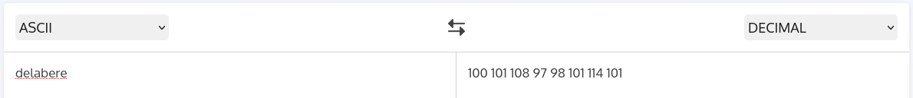

Finally, the reconstructed logic is verified in GDB. Setting a breakpoint just before the call to `strcmp()` confirms that the generated string is stored in one register while the expected password ("delabere") is passed in the other. From this analysis, the correct input is obtained by starting with two leading zeros, followed by the three-digit decimal ASCII values of the remaining characters of "delabere" (e, l, a, b, e, r, e).

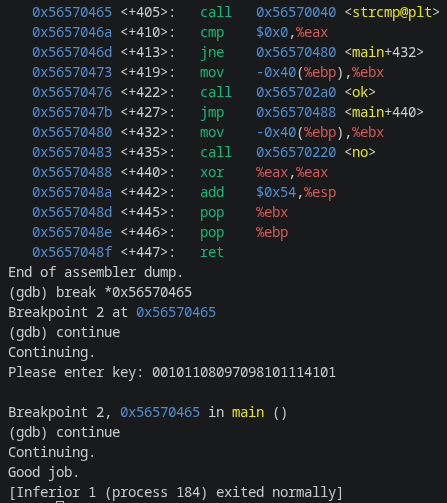

## Level 3

The analysis of this exercise follows exactly the same methodology as **Level 2**. After decompiling the binary with `Binary Ninja`, the generated pseudocode can be cleaned up into readable C code, revealing that the core algorithm is unchanged.

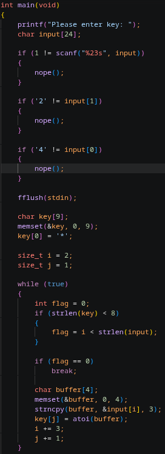 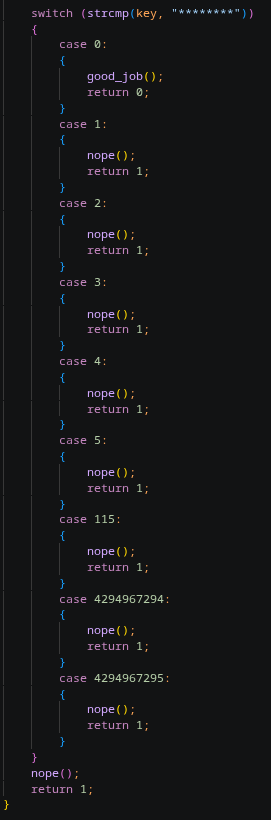

The program still reconstructs the expected key by first validating a fixed two-character prefix, then reading the remaining input in groups of three decimal digits. Each group is converted to its ASCII equivalent with `atoi()` and appended to the reconstructed string. As in the previous exercise, ASCII values below `100` must therefore be written with a leading zero to preserve the correct three-digit grouping.

The only meaningful differences are the required prefix (`"42"` instead of `"00"`), the initial character already stored in the reconstructed key (`'*'` instead of `'d'`), and the final string used by `strcmp()`. Apart from these constants, the reconstruction logic is identical to **Level 2**, allowing the same reverse engineering approach to be applied without any additional complexity.

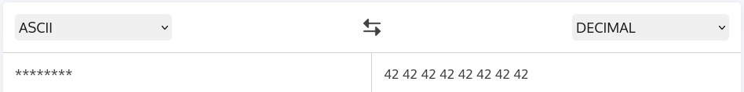

As before, the reconstructed string can be verified in GDB immediately before the call to `strcmp()`, confirming that the generated key matches the expected value stored by the program.

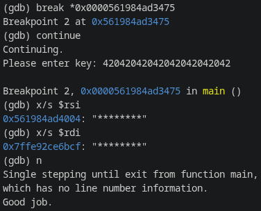

# Technical Notes

### **Reverse Engineering**

Reverse engineering involves analyzing software or a system to understand its internal workings, often with the aim of detecting vulnerabilities, improving security, or understanding the code without access to the source.

The reverse engineering process includes disassembly into assembly language to examine machine instructions and the use of decompilers to reconstruct more readable source code. This process is not limited to binaries compiled in C or C++; it also applies to other languages ​​such as .NET, Python, and Java, where specific tools are used to extract and analyze the code.

### **What is GDB?**

GDB, or the GNU Debugger, is a powerful debugging tool for programs written in C, C++, and other programming languages. It allows developers to execute their code in a controlled manner, inspect variables, step through execution, and diagnose errors. By using GDB, you can set breakpoints, examine memory, and analyze issues in depth.

### **What is Binary Ninja?**

Binary Ninja is an interactive decompiler, disassembler, debugger, and binary analysis platform.

### **Identify the binary file type:**

Running the `file` command on a binary is often the first step in reverse engineering analysis, as it allows you to quickly obtain essential information about the binary before using more advanced tools like GDB or a disassembler.

For example:

    root@340b9bb31046:/app/level1# file level1

Will output:

    level1: ELF 32-bit LSB pie executable, Intel i386, version 1 (SYSV), dynamically linked, interpreter /lib/ld-linux.so.2, BuildID[sha1]=eb5da614822252396c09636a0c179de2fe79938c, for GNU/Linux 3.2.0, not stripped  

- ELF: The file is in the binary and Linkable Format, the standard format for binary on Linux.
- 32-bit: The program is compiled for a 32-bit architecture. Registers, memory addresses, and pointers are 32 bits wide.
- LSB: Least Significant Byte: the binary data is in little-endian format. This is the byte order used by Intel x86 processors.
- pie executable: Position Independent binary. The program can be loaded at different memory addresses thanks to ASLR (Address Space Layout Randomization), which complicates certain attacks that exploit fixed addresses.
- Intel i386: The binary is intended for the 32-bit x86 architecture.
- dynamically linked: The program uses shared libraries (libc.so, etc.) that are loaded at startup, rather than embedding their code directly into the binary.
- interpreter /lib/ld-linux.so.2: It is the dynamic linker. At runtime, it is responsible for loading the necessary libraries before launching the program.
- not stripped: The symbols (function names, global variables, etc.) have not been removed. This is excellent news for reverse engineering, as tools like nm, objdump, gdb, or a disassembler will often be able to display function names (main, check_password, etc.) instead of mere addresses.

### **Extract the readable character strings from a binary file:**

Running the `strings` command on a binary extracts all readable character strings (ASCII and sometimes Unicode) contained in a binary file. 

For example:

    root@340b9bb31046:/app/level1# strings level1

Will output a list of readable strings like this:

    ...
    td@ 
    /lib/ld-linux.so.2
    "R9l	cj
    _IO_stdin_used
    __isoc99_scanf
    __cxa_finalize
    __libc_start_main
    ...

This output provides several useful pieces of information about the program. Here, the most interesting ones are:

    ...
    __isoc99_scanf
    printf
    strcmp
    Please enter key: 
    Good job.
    Nope.
    ...

We can infer that the program:

- Asks for a key.
- Compares this key to an expected value.
- Displays "Good job." if it is correct.
- Displays "Nope." otherwise.

### **Using the GNU Debugger:**

- Launch GDB: `gdb level[number]`.

- List all the binary functions: `info functions`.

- Display the assembly instructions of a function: `disassemble <function_name>`.

- Set a breakpoint at a function or address: `break <function_name or address>`.

- Run the program: `run`.

# Resources

- [Reverse Engineering definition](https://csi.ift.ulaval.ca/posts/reverse_engineering/)
- [GDB Manual](https://man7.org/linux/man-pages/man1/gdb.1.html)
- [Binary Ninja Online disassembler](https://dogbolt.org/?id=0f4f5fa4-6d58-4c8a-8f18-6f960baf701b#BinaryNinja=238)
