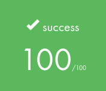
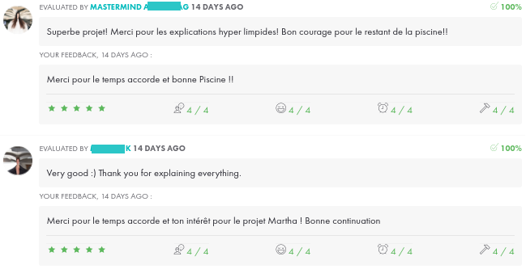

*This project was created in July 2026 as part of the 42 curriculum by tclouet.*

# Description

*This section presents the project, its goals, and a brief overview.*

`Stockholm` is an educational cybersecurity project exploring concepts related to malware analysis in a controlled environment.

The program is written in Python, and its dependencies are managed using a virtual environment created with `venv`.

# Instructions

*This section contains information about installation and execution.*

*Before starting, ensure that Python 3.11 or later and Docker Engine are installed.*

1. ### **Build and start the project:**

    At the root of the project, execute the following commands:

    - Display available commands: `make help`.
    - Build the Docker image: `make build`.
    - Start the Docker container: `make run`.
    - Open a shell inside the container: `make exec`.

    You are now inside the `/app` directory where the project files are stored.

2. ### **Set up the virtual environment:**

    From the `/app` directory, run the following commands:
	
    - Create a virtual environment: `python3 -m venv venv`. 
    - Activate the virtual environment: `source venv/bin/activate`.
    - Install the required dependency: `pip install pysodium`.
    - Verify that the virtual environment is active: `which python`.

#### Note:
    The `which python` command should return: `/app/venv/bin/python`.

3. ### **Run the program:**

    - `python3 create_test_files.py`: creates the test files required in the `/home/infection` directory.

    - `python3 stockholm.py`: encrypts the files located in the `/home/infection` directory.
    - `python3 stockholm.py -r [secret_key]`: restores the encrypted files using the provided secret key.
    - `python3 stockholm.py -s`: runs the program without displaying output.
    - `python3 stockholm.py -v`: displays the program version.

#### Note:
    To display the program help message, run: `python3 stockholm.py --help`

4. ### **Stop and clean up the project:**

    - To leave the Docker container, type: `exit`.
    
    - To deactivate the virtual environment, run: `deactivate`.

    - To clean the project: `make destroy`

#### Note:
    Running `make destroy` will prompt you for confirmation before removing the project resources.

# Technical Notes

**What is WannaCry?**

The WannaCry ransomware attack was a worldwide cyberattack that occurred in May 2017. It was carried out by the WannaCry ransomware cryptoworm, which targeted computers running Microsoft Windows by encrypting files and requesting ransom payments in Bitcoin.

The malware spread by exploiting the EternalBlue vulnerability, a Windows exploit developed by the United States National Security Agency (NSA). The exploit was leaked by a group known as The Shadow Brokers (TSB) one month before the attack.

Although Microsoft had already released security patches to address the vulnerability, WannaCry affected many organizations that had not applied these updates or were using outdated Windows systems.

**Why use Libsodium?**

Libsodium is a modern cryptographic library that provides secure and reliable tools for protecting data.

In this project, Libsodium is used to encrypt and decrypt files through the `crypto_secretbox` API. This function uses a secret key to encrypt data and adds a verification mechanism to detect any modification of the encrypted files.

Libsodium was chosen because it provides secure encryption methods while managing complex security aspects such as nonce generation and data verification. Using a trusted library helps avoid common mistakes that could occur when implementing cryptographic algorithms manually.

**Nonce**

A nonce (number used once) is a unique value used only once during a cryptographic operation. It ensures that encryptions performed with the same key produce different outputs, even when the input data is identical.

# Resources

- [What is WannaCry?](https://en.wikipedia.org/wiki/WannaCry_ransomware_attack)
- [MAN Pysodium](https://pypi.org/project/pysodium/)