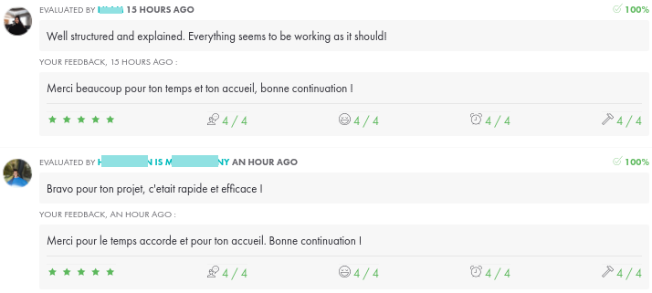

*This project was created in June 2026 as part of the 42 curriculum by tclouet.*




# Description

*This section presents the project, its goals, and a brief overview.*

The `ft_onion` exercise aims to run a web server that hosts a webpage accessible via the Tor network. The server must also be accessible via a secure SSH connection.

# Instructions

*This section contains information about installation and execution.*

*Before starting, please ensure that Docker Engine is installed.*

1. ### **SSH key generation:**

    To generate an Ed25519 public/private key pair, run:

    ```bash
    ssh-keygen -t ed25519 -C "root@ft_onion"
    ```

    The output will prompt you:
    
        Enter file in which to save the key (/home/tclouet/.ssh/id_ed25519):

    You can just press `Enter` to use the default path or type your own custom path to save your SSH keys.

    Next, you will see:

        Enter passphrase for "/home/tclouet/.ssh/id_ed25519" (empty for no passphrase):
    
    Important: For this project, you must set a passphrase, otherwise the connection will fail.

    After generation, your keys are saved as id_ed25519 (private) and id_ed25519.pub (public). Copy the content of id_ed25519.pub into your local project's ./ssh/authorized_keys file so it can be embedded into the container.

2. ### **Run the server:**

    - Build the Docker image: `docker build -t ft_onion .`
    - Run the Docker container: `docker run -p 4242:4242 ft_onion`

3. ### **SSH connection:**

    - To connect your terminal to the running container server, execute: `ssh -p 4242 [-i /custom/path/to/id_ed25519] root@localhost`

    You will be prompted to enter the passphrase you created in Step 1.

#### Note:
    SSH keys and containers:

    Since the SSH server runs inside a container, host keys may be regenerated frequently (for example when the container is recreated).

    You may see a SSH warning about a possible attack or key mismatch. This can be caused by the container key renewal and does not necessarily indicate a real attack.

    To remove the old key from `known_hosts`:
    
    `ssh-keygen -R "user:port"`


4. ### **Access the website:**

    Once the server is running, the Onion website URL will be displayed in the server logs, looking similar to this:

        NGINX started ✅. Website available on:
        v2ya2m55b6d34gzochlqh5adeqhs2dn7rjmab2i5ewmw7smo4aurckyd.onion

5. ### **Stop and clean the project:**

    - Stop the container:
      `docker stop <container_name>`

    - Remove the Docker image:
      `docker rmi -f ft_onion`

# Technical Notes

**The Tor Network**

Tor is an acronym for The Onion Router (i.e. organized in layers, like onions), a decentralized computer network that allows for client anonymity, relying on specific servers called nodes.

The purpose of Tor is to protect against traffic analysis, a form of network surveillance that threatens the anonymity and privacy of individuals, and activities. With Tor, communications bounce through a network of distributed servers (nodes), called onion routers, which protect you from websites that log the pages you visit, from external observers, and from the onion routers themselves.

To reduce the risk of simple or sophisticated traffic analysis, your transactions are distributed across multiple locations on the internet. Therefore, by observing a single point, it is impossible to identify you and your intended recipient. It's like using a convoluted and difficult-to-follow path to lose a pursuer (while erasing your tracks from time to time). Instead of taking a direct route between source and destination, data packets follow a random trajectory through multiple servers, making your tracks disappear. Therefore, no one can deduce from a single observation point where the data comes from or where it goes.

**SSH Protocol**

SSH (Secure Shell) is a protocol that establishes encrypted connections between computers, enabling secure remote access.

# Resources

[Tor hidden service and NGINX 1](https://www.youtube.com/watch?v=WU92NhhNujw)  
[Tor hidden service and NGINX 2](https://memo-linux.com/son-site-sur-le-reseau-tor-en-onion-avec-nginx/)  
[Tor hidden service and SSH](https://le-guide-du-secops.fr/2021/11/23/utiliser-le-reseau-tor-pour-acceder-a-un-hidden-service-nat-traversal-udp-hole-punching/#III_Publication_de_notre_premier_service_cache)  
